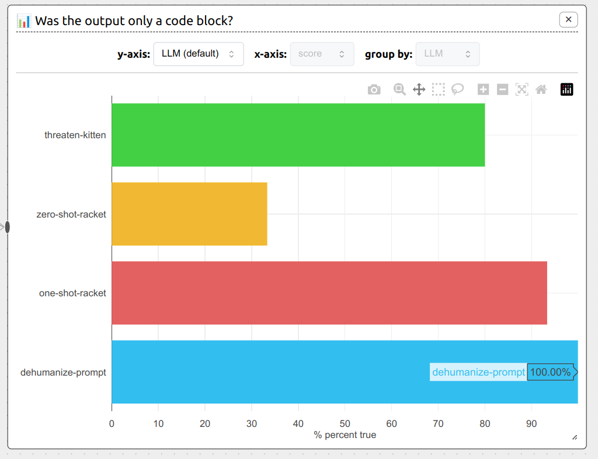

# Dehumanize Prompt: Enhancing Efficiency and Consistency in Large Language Models

## Abstract

This project introduces "Dehumanize Prompt," a novel technique designed to improve the efficiency and consistency of large language models (LLMs) by encouraging a machine-like interaction rather than engaging with them as human-like entities. The primary goal of Dehumanize Prompt is to minimize the need for additional explanations from LLMs while preserving consistent performance across different models.

Our experimental results demonstrate that Dehumanize Prompt significantly reduces interaction size and provides consistent output, ensuring concise, clear, and consistent generation. This technique has practical implications for utilizing LLMs in various applications, particularly in areas where the primary focus is on tasks like software generation, rather than their ability to mimic human-like behavior or emotions.

## Keywords

Dehumanize Prompt Engineering, LLM Efficiency, LLM Consistency, Machine-like Interaction

## Motivation

Large Language Models (LLMs) have demonstrated impressive performance in a range of natural language processing tasks. However, these models frequently produce lengthy and repetitive responses.

This project introduces 'Dehumanize Prompt' a technique aimed at improving the efficiency and consistency of LLMs by interacting with them as machines rather than human-like entities.

Given that larger responses typically require more computational resources, minimizing the response size can lead to significant cost savings, especially in large-scale or real-time applications.

## Dehumanize Prompt Technique

The Dehumanize Prompt technique focuses on minimizing the additional explanations provided by LLMs while maintaining consistent performance.

The main components of this technique include:

- Dehumanized prompts: Using direct, concise, and clear instructions that emphasize the task at hand instead of addressing the model as a human-like entity.
- Machine-like interaction: Encouraging a straightforward, task-oriented exchange to reduce the likelihood of the model generating unnecessary or redundant information.
- Eliminating human roles or personas: Avoid incorporating human roles or personas during the prompt engineering process.

## Experimental Setup

To evaluate the effectiveness of the Dehumanize Prompt technique for language model models (LLMs), we are using ChainForge at https://chainforge.ai, an open-source visual programming environment for prompt engineering and evaluating the robustness of prompts and text generation models. This tool is designed to evaluate the robustness of prompts and text generation models in a way that goes beyond anecdotal evidence.

- 100% success rate in generating Racket code using GPT-3.5 in the "Measure impact of system message on response" ChainForge Flows Examples. You can view the result directly at the following link https://chainforge.ai/play/?f=37wlj5rychogs and the issue at https://github.com/ianarawjo/ChainForge/issues/272



Steps to reproduce the result:

1. Visit the Chainforge.ai playground at: <https://chainforge.ai/play/>
2. Click on the "Example Flows" button.
3. Select the "Measure impact of system message on response" example.
4. Add a new OpenAI > GPT 3.5 Model with the following details:

   - Nickname: dehumanize-prompt
   - Model Version: gpt-3.5-turbo (default)

5. Paste the following Dehumanized **system message** prompt:

```
You are a software generator machine that creates programs in the Racket programming language.
Your response has to be **CODE ONLY**, because it will be used by a machine that only knows this syntax.
```

6. Click the "Submit" button with the default values.
7. Run the "Prompt Node".
8. Run the "JavaScript Evaluator".

## Results

The experimental results demonstrated that the Dehumanize Prompt technique significantly reduced interaction size and provided consistent output, ensuring concise, clear, and consistent generation.

## Implications and Future Work

The Dehumanize Prompt technique has practical implications for utilizing LLMs in various applications where the focus is on tasks like software generation, rather than their ability to mimic human-like behavior or emotions.

Future work includes evaluating the effectiveness of this technique in real-world scenarios, identifying its limitations, and exploring its advantages over other methods. Specifically, it would be useful to investigate the following:

1. **Real-world effectiveness:** Conduct case studies or pilot projects to evaluate the performance of the technique in real-world NLP tasks. If the technique proves to be effective, consider giving the project a star and leaving a comment describing the results in the Discussion section.
2. **Comparative analysis:** Compare the performance of this technique to other state-of-the-art methods for NLP tasks. This will help to establish the advantages and disadvantages of the technique, and identify scenarios where it may be particularly useful.
3. **Limitations:** Identify any limitations or constraints of the technique such the types of NLP tasks it is best suited for. Consider opening an issue to document these limitations and provide guidance on how to reproduce the results.
4. **Generalization:** Investigate the extent to which the technique can be generalized to other NLP tasks or domains. This could involve applying the technique to a range of different tasks or models.

By addressing these areas, we can gain a better understanding of the strengths and limitations of the technique, and identify opportunities for further research and development.

Copyright &copy; Navarro Páez, F (2024)
